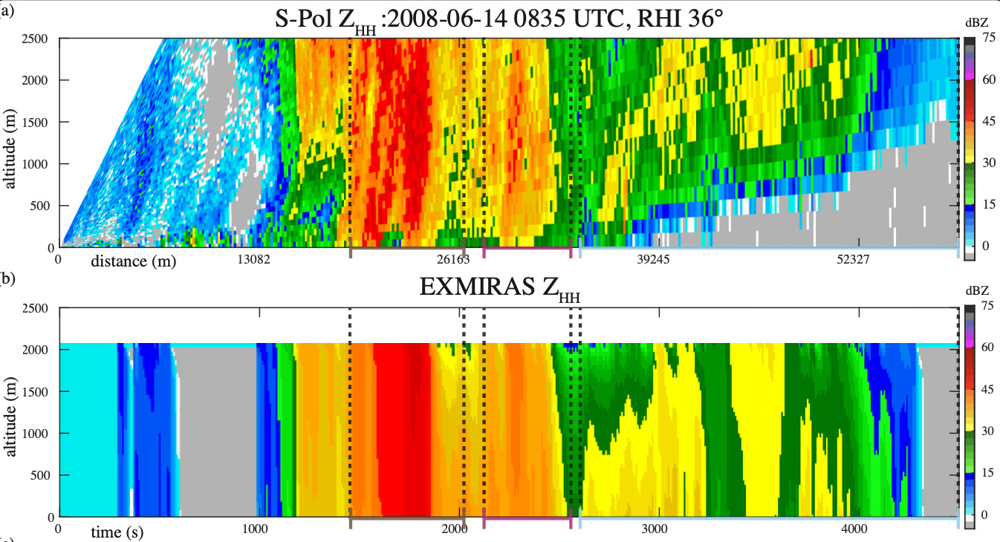

# EXMIRAS
The EXplicit MIcrophysics and RAdar Simulator (EXMIRAS; ex miras, Latin, "From wonders") is a rainshaft simulator for liquid precipitating water with a coupled dual-pol radar simulator. 

Above: (a) a RHI scan of horizontal reflectivity from S-Pol. (b) Example output from EXMIRAS, after assimilating the S-Pol data.

To begin, look at the [instructions.md](./docs/instructions.md) file. 

If not acquired from GitHub, new updates are located here: https://github.com/nrb171/EXMIRAS

If you use EXMIRAS in your published work, please cite this DOI: https://doi.org/10.5281/zenodo.17236519 
